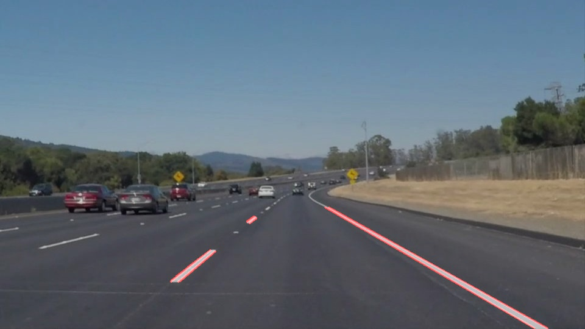

# **Finding Lane Lines on the Road** 

## Writeup report

**Finding Lane Lines on the Road**

The goals / steps of this project are the following:

* Make a pipeline that finds lane lines on the road
* Reflect on your work in a written report

---

### Reflection

### 1. Pipeline description

My pipeline consisted of 5 steps. 

First, I converted the images to grayscale, then I applied a Gaussian noise kernel to blur the grayscale images,

for the next, I applied the Canny transform on the blurred images to detect the edges. Then I maked a mask on the 

images to get the region of interest with a polygon, the last step is to apply the Hough transform on the images to

draw the lines on the images.

In order to draw a single line on the left and right lanes, I modified the draw_lines() function by calculating the

slopes ((y2-y1)/(x2-x1)) and intercepts (y1-((y2-y1)/(x2-x1))*x1) and separating line segments by their 

slope ((y2-y1)/(x2-x1)) to decide which segments are part of the left line vs. the right line. Then, I averaged the 

position of each line and extrapolated to the top and bottom of the lane.

### 2. Identify potential shortcomings with your current pipeline

One potential shortcoming would be the straight line detected may not match the curve lane when the crooked lanes appear

Another shortcoming could be the lane lines will not be detected when the ground presented has the similar color with the

lane lines

### 3. Suggest possible improvements to your pipeline

A possible improvement would be to use the polynomial method to match the curve lane

Another potential improvement could be to refer to results of the previous frame to generate the next results to smooth

the process when we lose signals or the detection is failed

